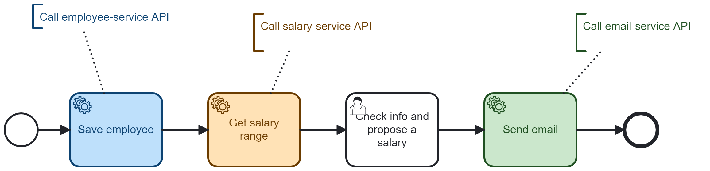
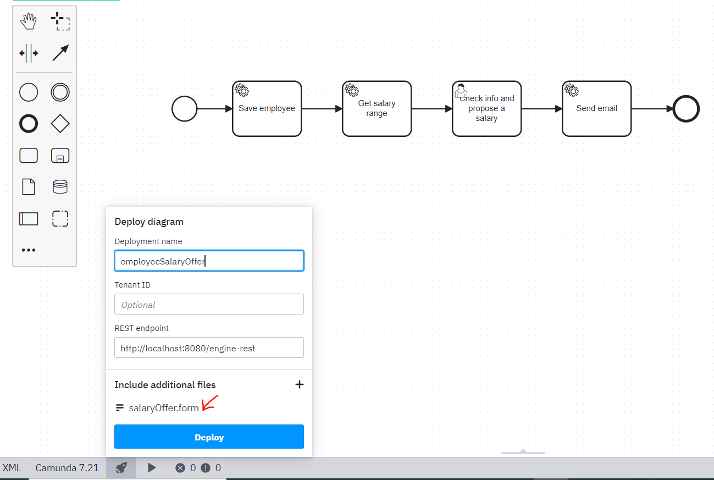

# APIs Orchestration using Camunda 7 Run

This repository is a fully working project that orchestrate microservice APIs using Camunda Run (Camunda 7).

### BPMN process

### Follow the step by step video tutorial on YouTube
You can follow the step by step YouTube video tutorial [here](https://youtu.be/s98PlGi5KyQ)  
Note: **The video is in French Language**

https://youtu.be/s98PlGi5KyQ

### Steps to start the project

1. Download Camunda Run [here](https://downloads.camunda.cloud/release/camunda-bpm/run/)
2. Unzip and Start Camunda Run
4. Move into this project `cd path-to-this-project`
5. Start the microservice with this command `java -jar microservice.jar`
6. Deploy the BPMN process and form through the Camunda Modeler

